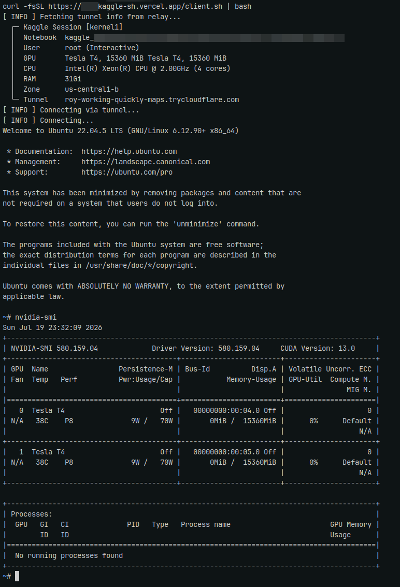

# kaggle-terminal

SSH into Kaggle notebooks with a single command using Cloudflare Tunnel and a Vercel relay.



## Deploy

Deploy to Vercel with environment variables `RELAY_SECRET` and `DATABASE_URL` (PostgreSQL).

> `kagglessh.vercel.app` is a demo alias. Replace with your own Vercel deployment URL.

## Usage

1. **Upload public key** (Laptop):

   ```bash
   export RELAY_SECRET="secret"
   curl -fsSL https://kagglessh.vercel.app/upload_key.sh | bash
   ```

2. **Start SSH** (Kaggle cell):

   ```bash
   export RELAY_SECRET="secret"
   !curl -fsSL https://kagglessh.vercel.app/kaggle_setup.sh | bash
   ```

3. **Connect** (Laptop):

   ```bash
   export RELAY_SECRET="secret"
   curl -fsSL https://kagglessh.vercel.app/client.sh | bash
   ```

## Options

- **List active sessions & specs**:

  ```bash
  export RELAY_SECRET="secret"
  curl -fsSL https://kagglessh.vercel.app/client.sh | bash -s list
  ```

- **Connect to custom kernel ID**:

  ```bash
  export RELAY_SECRET="secret"
  !curl -fsSL https://kagglessh.vercel.app/kaggle_setup.sh | bash -s -i kernel1
  ```

- **Stop tunnel**:

  ```bash
  export RELAY_SECRET="secret"
  !curl -fsSL https://kagglessh.vercel.app/kaggle_setup.sh | bash -s stop
  ```

- **Get raw SSH command**:

  ```bash
  export RELAY_SECRET="secret"
  curl -fsSL https://kagglessh.vercel.app/client.sh | bash -s raw
  # or copy directly to clipboard
  curl -fsSL https://kagglessh.vercel.app/client.sh | bash -s raw | wl-copy
  ```
