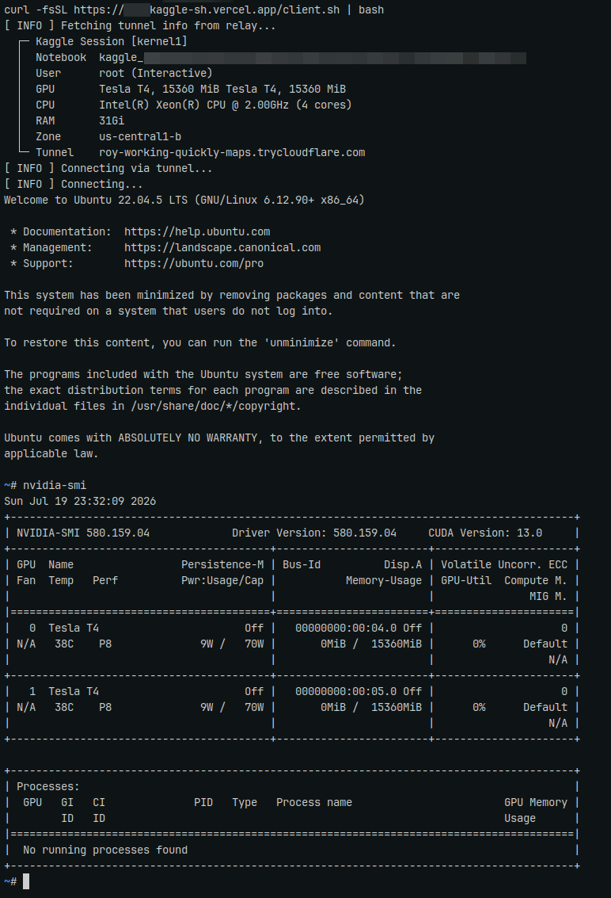

# kaggle-terminal

SSH into Kaggle notebooks with a single command using Cloudflare Tunnel and Vercel Relay.



## Deploy

[](https://vercel.com/new/clone?repository-url=https%3A%2F%2Fgithub.com%2Fadityabavadekar%2Fkaggle-terminal&project-name=mykagglessh&repository-name=mykagglessh&env=RELAY_SECRET,DATABASE_URL&envDescription=Random+authentication+secret%2CPostgreSQL+connection+string)

Requires `RELAY_SECRET` and `DATABASE_URL`. Replace `kagglessh.vercel.app` with your deployment URL.

> See `/info` for the dashboard and `/info.md?secret=YOUR_SECRET` for LLM-friendly docs.

## Usage

1. **Upload public key** (Laptop):

   ```bash
   export RELAY_SECRET="secret"
   curl -fsSL https://kagglessh.vercel.app/upload_key.sh | bash
   ```

2. **Start SSH** (Kaggle cell):

   ```bash
   export RELAY_SECRET="secret"
   !curl -fsSL https://kagglessh.vercel.app/kaggle_setup.sh | bash
   ```

3. **Connect** (Laptop):

   ```bash
   export RELAY_SECRET="secret"
   curl -fsSL https://kagglessh.vercel.app/client.sh | bash
   ```

## Options

- **List active sessions & specs**:

  ```bash
  export RELAY_SECRET="secret"
  curl -fsSL https://kagglessh.vercel.app/client.sh | bash -s list
  ```

- **Connect to custom kernel ID**:

  ```bash
  export RELAY_SECRET="secret"
  !curl -fsSL https://kagglessh.vercel.app/kaggle_setup.sh | bash -s -i kernel1
  ```

- **Stop tunnel**:

  ```bash
  export RELAY_SECRET="secret"
  !curl -fsSL https://kagglessh.vercel.app/kaggle_setup.sh | bash -s stop
  ```

- **Get raw SSH command**:

  ```bash
  export RELAY_SECRET="secret"
  curl -fsSL https://kagglessh.vercel.app/client.sh | bash -s raw
  # or copy directly to clipboard
  curl -fsSL https://kagglessh.vercel.app/client.sh | bash -s raw | wl-copy
  ```

## Scripting

```bash
export RELAY_SECRET="YOUR_SECRET"
curl -fsSL https://kagglessh.vercel.app/kssh.sh | bash -s run "ls -la"            # exec, capture stdout
curl -fsSL https://kagglessh.vercel.app/kssh.sh | bash -s put train.py /kaggle/working/   # upload
curl -fsSL https://kagglessh.vercel.app/kssh.sh | bash -s get /kaggle/working/out.csv .    # download

# Download helper script locally:
curl -fsSL https://kagglessh.vercel.app/kssh.sh?secret=YOUR_SECRET -o kssh.sh && chmod +x kssh.sh
./kssh.sh run "ls -la"
```
